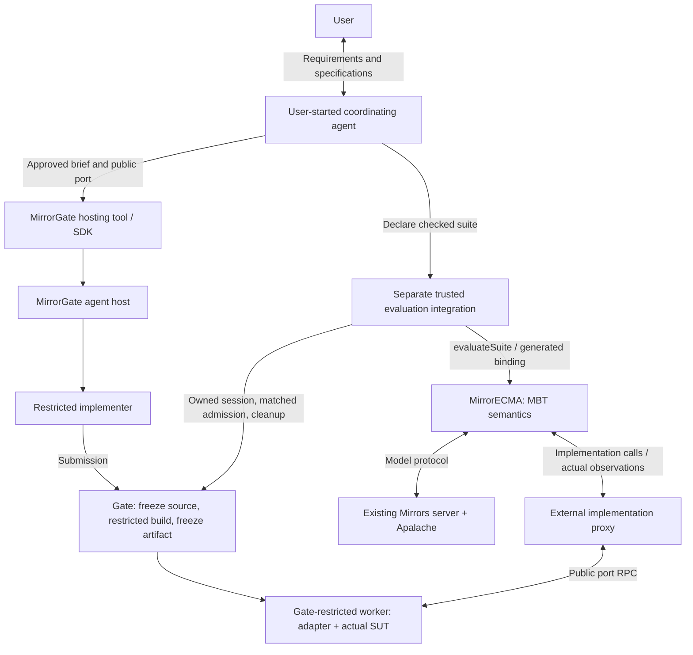

# MBT against implementations: MirrorECMA and MirrorGate ownership

Status: architecture accepted 2026-09-09; the 2.0.0 cutover and external Gate
integration are integrated and locally validated in the destination checkouts.
Full cross-client interop passed (`INTEROP MATRIX GREEN`). [Gate workflow validation](https://github.com/NzSN/MirrorGate/blob/main/docs/managed-workflow-validation.md) records
the completed destination, integration and real-implementer gates; publication
remains separate.
This supersedes the proposal to add managed-agent authoring to MirrorECMA.
No `author: {kind: "managedAgent", ...}` option will be added under this design.
The former experimental `evaluateSandboxed` facade is owned by
`mirrorgate-mirrorecma/legacy`; it is absent from the 2.0 core. See the
[versioned migration guide](migration-v2.md).

## Decision

MirrorECMA's semantic responsibility is model-based testing against an
implementation. It negotiates a model interface, obtains a compatible execution
binding from a caller-supplied factory, runs the model-directed actions, reports
observations, and manages its generic replay/binding lifecycle. It does not need
to know whether a human or agent authored the implementation, or whether the
implementation is local, remote, or isolated by MirrorGate.

The user starts the coordinating coding agent. That agent interacts with
MirrorGate directly to request a separate implementer in restricted authoring.
Gate owns the implementation brief, agent configuration and launch, restricted
tools, submission, source/build/artifact lifecycle, and worker cleanup.

A separately packaged trusted integration composes Gate's implementation proxy
with MirrorECMA's public MBT interfaces. Its initial source home is MirrorGate's
`integrations/mirrorecma/`; it is outside MirrorECMA's semantic API and outside
Gate's language-neutral supervisor core. The integration may depend on both
public libraries. Neither core library needs the other's internal modules.

## Primary workflow

1. The user and coordinating agent develop behavior and invariant specifications.
   Model checking evaluates the invariants against that behavior under the
   selected configuration. This is distinct from testing the later implementation.
2. The model-interface compiler publishes the trusted async suite model and
   native application port. It does not generate the SUT or its
   implementation-specific adapter. Full model-facing bindings stay in trusted
   evaluation; approved port declarations and sufficient behavior requirements
   can be sent to the author.
3. The evaluator declares an immutable MirrorECMA suite with its checked corpus
   and matched-coverage requirements. The coordinator calls Gate's hosting interface with an approved public brief,
   port declarations, and a permitted profile. This is a Gate tool/SDK request,
   not a MirrorECMA authoring option. The coordinator also writes the MBT harness.
4. Gate launches a fresh restricted implementer, mediates its development tools,
   and accepts its explicit submission. Gate quiesces writers, freezes source,
   performs restricted build/preparation, and freezes the artifact.
5. Local callers use `runSuite`; the Gate-owned integration runs the same
   definition through `evaluateSuite` and the existing Mirrors server transport.
   Required model matching occurs before Gate authorizes/acquires the evaluation
   worker. The integration supplies the generated public-port binding over the
   external proxy.
6. MirrorECMA replays actions and reports actual observations to Mirrors. The
   external integration maps calls/disposal to the proxy and awaits Gate cleanup.
   Model conformance and sandbox cleanup remain separate outcomes.

The diagram describes the integrated ownership boundary. Destination live CI,
Gate hosting, the optional evaluation integration and core-decoupling gates have
passed. Full cross-client interop passed (`INTEROP MATRIX GREEN`). Mirrors transports, generated
bindings and generic replay retain their existing semantics.
Apalache is the integrated model backend. TLC can be a separate specification
check; an automated TLC backend/trace conversion is not supplied by this design.

## Semantic interface and dependency direction

| Layer | Accepts | Must not require |
| --- | --- | --- |
| MirrorECMA core | Model/transport/replay configuration, caller-supplied implementation binding or factory, generic cancellation and disposal | Gate endpoint/policy/session, agent profile/prompt, build plan, artifact lease, or Gate SDK |
| Gate host and control SDK | Approved authoring inputs, runtime/tool profiles, session/resource limits | Private model interpretation or MirrorECMA internals |
| External evaluation integration | Public MirrorECMA and Gate interfaces, trusted compiled binding, caller-owned evaluation/disclosure configuration | A second Gate state machine or unrestricted submission execution |
| Coordinator's hosting tool | Approved task inputs and caller-scoped run references | Raw administrative handles or private evaluator diagnostics in agent-visible results |

The Gate-side admission, snapshot, sandbox-launch, worker, and cleanup ownership
behind this table is specified in the
[MirrorGate supervisor design](https://github.com/NzSN/MirrorGate/blob/main/docs/sandbox/supervisor-design.md).

The existing [async adapter factory](../src/adapter-registry.ts) accepts
`(config, authority)` and returns `AsyncLocalBinding`, registered through
`AsyncCompiledAdapterRegistry`. The ordinary
[negotiated report runners](../src/negotiated.ts) validate the matched reply
before invoking that factory. The external integration can perform Gate
authorization/acquisition there and use the compiler's generic public-port
binding over its proxy. A prepared artifact plus deferred factory is the seam;
passing an already-started evaluation worker would break the admission ordering.

An implementation may be an in-process object or an external proxy satisfying
the same port. If a missing generic capability is discovered, specify it in
implementation-neutral terms and validate at least a local implementation and
an external one; do not add Gate-specific fields to MirrorECMA to close the gap.

The compiler-generated binding stays trusted. It converts model requests into
public operations and encodes actual observations. Raw `StateComputer` inputs,
expected states, previous model states, and private trace metadata must not be
forwarded to the submitted adapter merely because it is behind a proxy.

The optional integration depends on MirrorECMA's public MBT interface and Gate's
public SDK. MirrorECMA's core must not import Gate, start/attach its process,
load agent credentials, construct author prompts, build the submission, or
decode Gate worker/control frames. Gate's supervisor remains usable without
MirrorECMA, including through other native client integrations.

## Admission, session ownership, and cleanup

Separating libraries does not remove lifecycle obligations. The external trusted
integration retains the owning Gate control connection across authoring,
preparation, evaluation admission, replay, and cleanup. A reference returned to
the coordinator is not permission for another connection to adopt that session.
The hosting tool and evaluator must cooperate under that owner. Specify the
embedding/handoff in Gate's control contract; do not invent reconnect behavior.

Authoring/public tests may run before model negotiation. The evaluation worker
must not launch before a successful required match. The external integration
obtains the generic negotiation/factory acceptance and constructs Gate's trusted
attestation there; Gate independently checks session/challenge/profile ownership
before worker acquisition. The full negotiation authority, including transport,
configuration and private replay access, remains evaluator-side; send only the
bounded attestation fields Gate requires. No private model data goes into the
author context.

MirrorECMA propagates its normal cancellation/deadline and binding-disposal
semantics. The supplied binding/factory delegates physical worker release to
the external integration and Gate. That integration must also clean resources
when negotiation fails before a factory is called. Gate terminates processes
and owns cleanup receipts; cancellation acknowledgement is not quiescence.
The integration reports MBT and cleanup outcomes without changing MirrorECMA's
generic result semantics or treating unconfirmed cleanup as confirmed success.

The Mirrors server uses a separate model transport. Gate ownership does not
imply ownership of the already-running server, which remains available when
an evaluation connection closes.

## Information and execution restrictions

The coordinator/evaluator decides which brief, port declarations, files, and
behavior requirements are public. "Public" means approved for the implementer,
not published on the internet. Gate delivers them in fresh context; the whole
coordinating conversation or complete model is not automatically inherited.
Supplying this brief is a Gate-facing responsibility, outside MirrorECMA.

| Stage | Executed code | Allowed data |
| --- | --- | --- |
| Authoring | Agent development tools | Approved requirements/tools and writable source |
| Build | Submission scripts, dependency hooks, compiler plugins | Frozen source, approved toolchain/dependencies, writable output |
| Execution | SUT/adapter initialization and operations | Frozen artifact, public operation inputs, writable SUT state |

Build scripts and adapter initialization are executable submission code. Running
them in the trusted evaluator can reopen private file/environment access after
authoring ends. Gate therefore retains restricted build and runtime profiles.
The trusted integration imports the generated binding/proxy, not the submitted
adapter. These can be temporary environments on one host. Minimal preparation
for a no-compilation language still freezes the artifact and restricts loading.

## Reusable harness and proxy-accessible evaluation

The MBT harness may be an application source module, called by ordinary test
files, a CLI, or a trusted evaluation-service handler. Reuse the same suite and
generic implementation factory in each entry point. An implementation proxy
lets the suite exercise an external SUT; an evaluation-service proxy lets an
external caller request the whole evaluation. These can be composed without
adding Gate/service concepts to MirrorECMA's semantics.

Source co-location does not authorize an implementer to read private tests or
replace the evaluator's approved suite revision. The service owns private suite
selection and result disclosure; Gate owns worker isolation/cleanup. See
[reusable MBT harnesses](mbt-harness-design.md) and the
[optional evaluation service](https://github.com/NzSN/MirrorGate/blob/main/docs/evaluation-service-design.md).

## Versioned coupling removal

The 2.0.0 source cutover removes `src/sandbox.ts`, `src/sandbox-model.ts`, their
root exports and the optional Gate peer. The implementation, model/manifest
validation, four unit suites and native TypeScript matrix driver move to
MirrorGate's optional integration. Core does not import a forwarding shim.

Existing consumers change Gate-aware imports to `mirrorgate-mirrorecma/legacy`;
generic imports remain `mirrorecma`. The [2.0 migration guide](migration-v2.md)
records all removed exports, evidence destinations and installed-package checks.
Historical results and their helper-driven runtime claims remain historical.
The cutover and destination integration are validated; package publication is
a separate action. The earlier isolated preparation stage is historical evidence.

## Projected-collection workflow findings

A 2026-09-10 restricted application run exercised a generated async interface
whose projected observations included sets and a sequence of records. The final
implementation passed 14 traces and 49 transitions with confirmed Gate cleanup;
a fault injection passed its public build and was rejected during model replay.
This is dated local evidence recorded by the Gate workflow, not a MirrorECMA
release or exhaustive model claim.

The run does not change this document's dependency decision. It sharpens the
following ownership rules:

- generated MirrorECMA ports retain their implementation-neutral array-shaped
  collection representation; Gate's Node worker SDK owns conversion to native
  `Set` and `Map` values and should supply any implementer-side adapter kit;
- build mount discovery, immutable repair attempts, source seeding, terminal
  cleanup retrieval, and trusted receipt persistence belong to Gate or its
  optional integration, not MirrorECMA core;
- if MirrorECMA adds stable mismatch classes, they must describe generic replay
  failures without Gate concepts. The Gate integration and evaluator disclosure
  policy separately decide whether an allowlisted class or public observation ID
  may leave trusted evaluation; and
- a cross-repository projected-collection fixture should call only MirrorECMA's
  public factory, negotiation, replay, report, and disposal APIs. It must not add
  a Gate endpoint, agent option, build plan, or receipt store to this package.

The proposed Gate-side work and disclosure limits are tracked in the
[restricted workflow follow-ups](https://github.com/NzSN/MirrorGate/blob/main/docs/sandbox/restricted-workflow-followups.md).
This historical application result alone did not establish those proposals.
Subsequent application integration delivered G1, G2, G5 and G7 on
2026-09-16–17; G3, G4 and G6 remain separate follow-ups in that ledger.

## Acceptance

- Ordinary MirrorECMA tests, imports, declarations, local implementation replay,
  cancellation, and reports work without Gate installed or configured.
- A proxy implementation runs through the same generic MBT entry point as a
  local implementation, with no Gate-specific options in MirrorECMA core.
- The coordinator requests hosting directly from Gate; no MirrorECMA author
  option, prompt transport, agent launcher, or build orchestration is involved.
- The external integration uses public interfaces and preserves required-match
  zero-worker-launch failures, same-owner handoff, private-data projection,
  cancellation, source/artifact identity, and bounded cleanup.
- Real restricted authoring/build/worker probes and correct/faulty replay pass;
  mock proxies alone do not establish isolation or managed-host acceptance.
- Existing experimental consumers have a documented, tested migration path;
  source/dependency inspection confirms the promised core decoupling.

The [Gate task ledger](https://github.com/NzSN/MirrorGate/blob/main/docs/agent-hosting-tasks.md) records AH8
for integration extraction/consumer migration and AH11 for the coordinator's
standard hosting tool. Their final acceptance is independent of core package checks.
