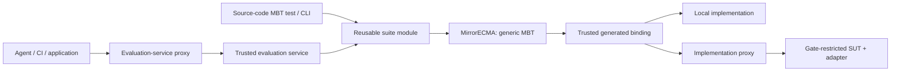

# Reusable MBT harnesses and evaluation access

Status: the reusable Counter suite, source tests/CLI and MirrorECMA 2.0.0
core boundary are integrated and locally validated in the destination checkouts.
Gate's optional local service, source/CLI/MCP entry points and real restricted
implementer path passed installed-consumer acceptance against the same suite.
Full cross-client interop passed (`INTEROP MATRIX GREEN`). See [Gate workflow validation](https://github.com/NzSN/MirrorGate/blob/main/docs/managed-workflow-validation.md) for
recorded evidence; publication and remote deployment are separate.
The [implementation boundary](implementation-boundary-design.md) keeps
MirrorECMA independent of agent hosting, Gate orchestration and service transport.
The runnable application example is [MBT Counter](../examples/mbt-counter/README.md).

## One harness, multiple entry points

An MBT harness is a reusable application module that combines a selected model,
generated binding, replay configuration, and caller-supplied implementation
factory. It invokes MirrorECMA's generic MBT runner. A source-code test, CLI,
or evaluation-service handler calls that same module rather than maintaining
separate test semantics for each entry point.

```text
src/
  counter.ts
  counter-adapter.ts
mbt/
  counter-suite.ts       # reusable trusted evaluation logic
  counter.mbt.test.ts    # test-runner entry point
evaluation/
  server.ts             # optional evaluation-service entry point
  gate-provider.ts      # external integration with Gate
```

This is an illustrative consumer layout. It is not a directory structure already
scaffolded by MirrorECMA, and Gate-specific files belong to application/external
integration code, not the MirrorECMA core package.

The harness takes a deferred implementation factory. For example:

```ts
// Illustrative application code; context and selection helper are app-defined.
export async function checkCounter(context, implementationFactory) {
  return runClientWithTracesNegotiatedWithReport(
    context.mirror,
    context.modelConfig,
    context.tracePaths,
    makeCounterSelection(implementationFactory),
    { signal: context.signal },
  );
}
```

`runClientWithTracesNegotiatedWithReport` is an existing MirrorECMA function.
`makeCounterSelection` is an illustrative application helper, not a new library
API. It registers the exact compiler-generated key and deferred async factory
with `AsyncCompiledAdapterRegistry`. The factory runs after the required model
match, creates a binding over the selected implementation, and supplies disposal.
It must not prelaunch a Gate evaluation worker before negotiation.

A test-runner wrapper calls `checkCounter` and lets a mismatch reject/fail the
test. A CLI maps the same result/failure to output and exit status. An optional
service invokes the same harness and projects the permitted result for its caller.
None of these wrappers turns agent authoring, worker allocation, or transport
into MirrorECMA's model semantics.

## Two different proxies

| Proxy | Caller and destination | Purpose |
| --- | --- | --- |
| Implementation proxy | Trusted generated binding -> external SUT/adapter | Invoke declared operations and obtain actual observations |
| Evaluation-service proxy | Agent, CI, application, or test wrapper -> trusted evaluator | Request a complete MBT run and inspect/cancel that run |

They can be composed. A remote evaluation caller need not possess the suite's
private model or run the harness locally. The evaluator may itself use either a
local implementation or a proxy to a Gate worker.



These are alternative paths; a single replay does not need two implementations
at once. Gate ownership/admission is managed by the separate trusted integration
and remains outside this simplified data-flow diagram.

## Source-code tests and private evaluation

MBT modules and test files can be versioned in the same project as implementation
source. Repository layout does not decide who can read or modify the authoritative
evaluation suite. Public development tests can be visible to the implementer;
private suites/models/traces must be excluded from its mounts and context.

The trusted evaluator selects an approved, immutable suite revision, generated
binding identity, and private test configuration separately from the submitted
artifact. It must not import a submission-controlled replacement of its own
suite with evaluator privileges. Running author-written public checks is valid
development activity but is not approval of those checks as the private oracle.
Where a repository mixes private evaluation material with source, export only
approved files to authoring/build/worker mounts rather than mounting its root.

The generated binding remains evaluator-side. It converts model state into
public port calls; neither proxy should forward raw `StateComputer` arguments,
expected states, private trace coordinates, or unrestricted diagnostic streams
to a submitted implementation or unapproved evaluation caller.

## Optional evaluation-service contract

The service is a separately deployed wrapper around the harness. When it uses
Gate, its implementation belongs to the optional trusted Gate/MirrorECMA
integration. MirrorECMA does not become an RPC server or gain Gate-specific
options. Applications provide their approved suite modules and disclosure policy.

The Gate-owned proxy exposes these implemented operations:

```text
start({startKey, suiteRef, implementationRef}) -> run
get({runId} | {startKey})                     -> current run
cancel(runId)                                -> cancellation acknowledgement/run
wait(runId)                                  -> terminal run
```

The [versioned service contract](https://github.com/NzSN/MirrorGate/blob/main/docs/evaluation-service-contract-v1.md)
defines authenticated loopback HTTP, closed records, epochs and bounds. These
are optional Gate integration APIs, not MirrorECMA exports. The service resolves
approved suites and implementations under the caller's authority,
records the exact resolved revisions, and retains resources through cleanup.
It accepts references rather than remotely supplied JavaScript functions, arbitrary
host paths, private model text, or raw Gate handles. Suite selection must not
let a caller relax the evaluator's configured disclosure or isolation policy.

The service run reference is different from a Mirrors session, Gate operation,
worker handle, or hosting run. Its status includes an allowed model outcome and
separate cleanup state. Cancellation acknowledgement is not completion, and a
lost start reply must not cause an automatic duplicate evaluation. Full progress
bounds, correlation, request deduplication/query, caller authorization, retention
and disconnect semantics are specified by that versioned service contract and
validated independently of model and isolation behavior.

See [Gate's evaluation-service design](https://github.com/NzSN/MirrorGate/blob/main/docs/evaluation-service-design.md)
for resource ownership, the relationship to hosting, and acceptance requirements.
An evaluation RPC layer does not add remote control or reconnect to Gate v1.

The [AH8 migration work plan](mbt-integration-tasks.md) assigns reusable-suite
and source-test/CLI work separately from Gate hosting and optional service
delivery. It preserves the same generic MBT implementation-factory seam.

## Acceptance

- One approved suite is invoked from a source test/CLI and from the service,
  with matching semantic outcomes for the same model, implementation, and replay
  configuration. Timing/run identifiers may differ.
- Local and proxied implementations use the same generic negotiated factory
  seam. Gate-free MirrorECMA consumers remain supported.
- Public-source test co-location does not expose private suites to authoring;
  attempts to replace the trusted suite from a submission are rejected.
- A real evaluation-service caller can start/query/cancel a run; cross-caller
  references, unknown suites, malformed requests, duplicate/lost starts, excessive
  output, and cleanup failure follow the specified bounded outcomes.
- Required match still precedes a Gate evaluation worker, and private model
  data stays out of both public-port RPC and service result projections.
- Test/service wrapper reuse is separate from proving actual sandbox isolation;
  Gate profiles still need real authoring/build/worker denial and cleanup checks.

AH8 in the [Gate task ledger](https://github.com/NzSN/MirrorGate/blob/main/docs/agent-hosting-tasks.md) owns
shared integration/harness migration; AH12 owns the optional service contract,
proxy entry point, and service acceptance. Source tests need not depend on AH12.
